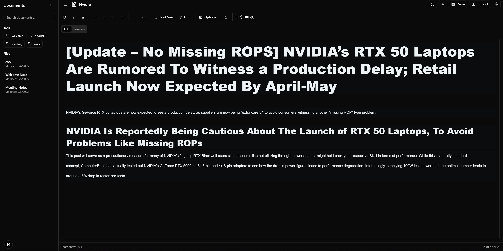

# TextEditor 2.0

A modern, feature-rich text editor built with Next.js and React that combines powerful editing capabilities with a clean, intuitive interface.



## Features

### Rich Text Editing
- **Text Formatting**: Bold, italic, underline, strikethrough
- **Paragraph Styles**: Headings, alignment options
- **Lists**: Ordered and unordered lists
- **Code Support**: Syntax highlighting for code blocks
- **Real-time Preview**: See rendered content as you type

### Document Management
- **Multiple Documents**: Create and manage multiple documents
- **Auto-save**: Configure automatic saving at custom intervals
- **Document Organization**: Tag and search your documents
- **Local Storage**: All documents are saved to your browser's local storage

### Export Options
- **PDF Export**: Generate PDF documents with proper formatting
- **Markdown Export**: Convert your content to Markdown format
- **HTML Export**: Export as clean HTML files

### User Experience
- **Light/Dark Mode**: Switch between themes as needed
- **Full-Screen Editing**: Distraction-free writing experience
- **Line Numbers**: Optional line numbering for code-focused documents
- **Keyboard Shortcuts**: Productivity-enhancing shortcuts
- **Customizable Settings**: Tailor the editor to your preferences

## Getting Started

### Installation

```
# Clone the repository
git clone https://github.com/yourusername/texteditor-2.git

# Navigate to the project directory
cd texteditor-2

# Install dependencies
npm install

# Start the development server
npm run dev
```

Open [http://localhost:3000](http://localhost:3000) with your browser to see the editor.

### Usage

1. **Creating a New Document**:
   - Click the "+" button in the sidebar or use the "New Document" button in the toolbar

2. **Formatting Text**:
   - Use the formatting toolbar above the editor
   - Or use keyboard shortcuts (Ctrl+B for bold, Ctrl+I for italic, etc.)

3. **Saving Documents**:
   - Click the save icon or press Ctrl+S
   - Enable auto-save in settings for automatic backups

4. **Exporting Content**:
   - Click the "Export" dropdown
   - Choose your preferred format (PDF, Markdown, HTML)

5. **Managing Documents**:
   - Click the folder icon to see all your documents
   - Use tags and search to find specific content
   - Delete unwanted documents with the trash icon

## Keyboard Shortcuts

| Shortcut | Action |
|----------|--------|
| Ctrl+B | Bold |
| Ctrl+I | Italic |
| Ctrl+U | Underline |
| Ctrl+S | Save |
| Ctrl+L | Bullet List |
| Ctrl+O | Numbered List |

## Technologies Used

- **Next.js 15**: React framework for production
- **React 19**: UI library
- **TailwindCSS 4**: Utility-first CSS framework
- **Radix UI**: Accessible component primitives
- **jsPDF**: PDF generation
- **Turndown**: HTML to Markdown conversion
- **Lucide Icons**: Beautiful, consistent icon set

## Customization

The editor can be customized through the settings dialog:
- Toggle auto-save functionality
- Set custom auto-save intervals
- More customization options coming soon.

## Contributing

Contributions are welcome! Please feel free to submit a Pull Request.

## License

This project is licensed under the MIT License - see the LICENSE file for details.

## Acknowledgments

- All the open-source libraries that made this project possible
- The Next.js team for creating an amazing framework


